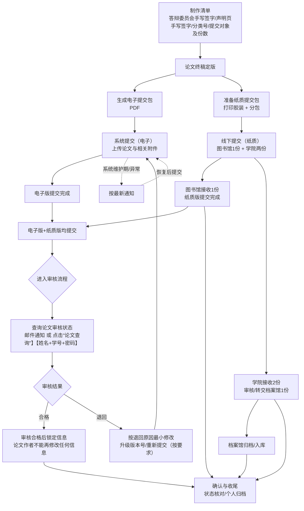

# 毕业论文提交 SOP

> 适用范围：面向需要完成“系统提交 + 纸质提交 + 归档确认”的毕业论文提交场景。
>
> - 文档版本：v0.1
> - 最后更新：2026-05-23
> - 创建人：S3121
> - 适用范围：外国语学院/外国语言文学专业/2023级学硕
> - 参考依据：<学校/学院/教务/研究生院/图书馆最新通知链接或文件名>
>   1. 图书馆发布：[硕博学位论文提交](https://www.lib.xjtu.edu.cn/engine2/general/more?appId=743992\&pageId=131204\&wfwfid=17071\&websiteId=27676\&rootAppId=\&ctypeId=2661238)
>   2. 论文规范及模板：**<http://gs.xjtu.edu.cn/>**
>   3. 中图分类法：[首页](https://5ope7ecu.mh.chaoxing.com/)
> - 使用方式：仅供参考

## 1. 总览流程图

 

## 2. 原则与产出

### 2.1 原则

- 以学校/学院/教务发布的最新要求为准
- 先对齐“要求清单”，再开始签字/打印/上传，避免返工
- 全程版本化管理：同一份论文的“定版”必须唯一可追溯

### 2.2 典型产出物

- 论文终稿（pdf版本+3份胶装论文）
- 相关材料：决议、答辩委员会页、声明页等
- 归档/提交证据：系统回执、邮件/通知截图等

## 3. 提交要求清单

### 3.1 学院2份

1. 纸质版：最好与提交给图书馆的版本一致，分类号、答辩委员会页的签名可视情况而定。
2. DDL：参考通知。

### 3.2 图书馆1份

1. **先提交电子版**：访问“**图书馆主页**”，选择“新生&毕业”菜单，点击“**硕博士学位论文提交**”，选择“学位论文提交网址”，提交毕业生基本信息，上传学位论文电子版最终PDF版本。

   登录：学号（10位学号）、姓名、密码（首次登录，密码请自行设置，密码长度不少于6位）

   如果登录提交系统时，系统提示：学号不存在，已自动注册，请等待管理员审核！请耐心等待，管理员会及时添加你的信息，添加后方可提交。也可以请将您的姓名、学号发邮件：<lib_thesis@xjtu.edu.cn>，或电话：029-82667865。

**再提交印刷版**：**硕士提交1本**，提交的学位论文必须是通过学位论文答辩后修订的最终版本，印刷版和电子版内容一致！**印刷版的“答辩委员会页”中委员必须签字，“声明”页必须有导师和论文作者签字。**

**电子版和印刷版均提交后，开始审核流程！**

兴庆校区提交地址：图书馆南楼东翼一层科研支持服务部（入口处：从图书馆大楼外边，走到学校网络信息中心小楼西侧对面）

雁塔校区提交地址：图书馆五楼科研支持服务部

创新港校区提交地址：创新港9号楼图书资料中心流通台

1. DDL：电子版和印刷版都提交给图书馆之后启动审核流程。各位毕业生在离校之前，请参考论文审核周期（一般需要2个工作日，毕业季高峰期间，论文提交量大时需要3-5个工作日）。

## 4 系统提交与状态跟踪

- 提交电子版后可以保存：提交时间、提交记录截图、系统回执文件（如有）
- 查询方式：邮件通知，或在系统里查询审核状态
- 注意事项：审核合格后论文作者将不能再修改任何信息，提交前务必完成自检与关键信息核对。毕业生在离校之前务必完成审核。

## **5 最终提交前自检清单**

- [ ] 论文终稿已定版（版本号固定、文件名规范）
- [ ] 所有元数据字段与论文封面信息一致
- [ ] 文档号、签字页齐全且满足“原件/复印/扫描”要求
- [ ] 纸质材料与对应接收方要求一致
- [ ] 系统提交完成
- [ ] 线下提交完成
- [ ] 审核状态是否确认

## **6 确认问题清单参考**

- [ ] 系统提交与纸质提交的先后顺序（先电后纸/并行/维护期例外）
- [ ] 论文纸质版最终需要总计几本、分别交到哪里
- [ ] 签字页是否必须原件、是否可复印/扫描、是否需要日期
- [ ] 是否要求填写分类号/分类码；需要印刷还是可手写
- [ ] 退回修改的边界：哪些修改会影响已签字材料（影响则需重新签字/重新装订）

