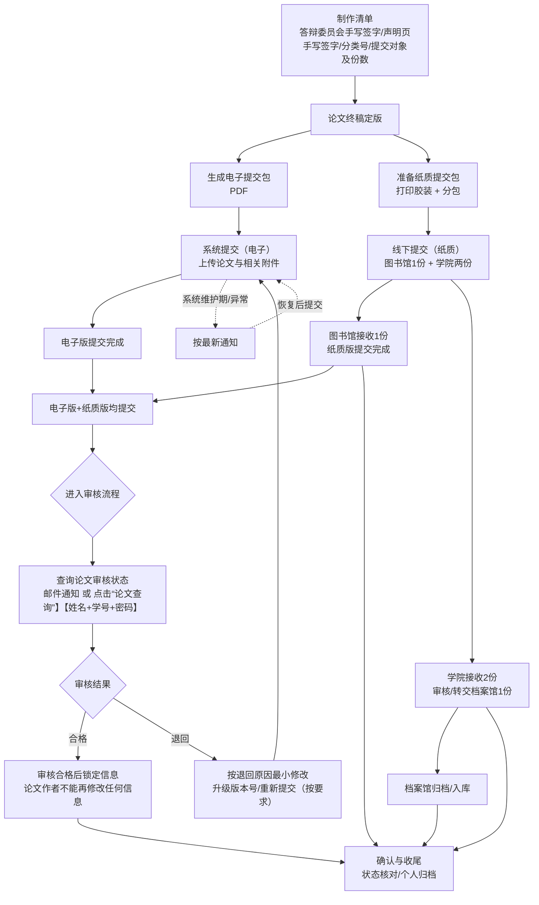

# 毕业论文提交 SOP

> 适用范围：面向需要完成“系统提交 + 纸质提交 + 归档确认”的毕业论文提交场景。\
> 使用方式：仅供参考。

## 0. 文档信息

- 文档版本：v0.1
- 最后更新：2026-05-23
- 创建人：S3121
- 适用项目：外国语学院/外国语言文学专业/2023级学硕
- 参考依据：<学校/学院/教务/研究生院/图书馆最新通知链接或文件名>
  1. 图书馆发布：[硕博学位论文提交](https://www.lib.xjtu.edu.cn/engine2/general/more?appId=743992\&pageId=131204\&wfwfid=17071\&websiteId=27676\&rootAppId=\&ctypeId=2661238)
  2. 论文规范及模板：**<http://gs.xjtu.edu.cn/>**
  3. 中图分类法：[首页](https://5ope7ecu.mh.chaoxing.com/)

## 1. 总览流程图



#### 0.1 节点索引

> 说明：GitHub/Gitee 的 Mermaid 渲染通常不支持“点击节点跳转”。这里提供等价的“图下方索引链接”，点击可跳转到文档固定段落。

- 对齐提交要求清单 → [第 3 节](#sec-checklist)
- 论文终稿定版 → [第 5.1 节](#sec-freeze)
- 签字页准备与管理 → [第 5.3 节](#sec-sign)
- 打印装订与分包 → [第 5.4 节](#sec-print)
- 系统提交（电子） → [第 5.5 节](#sec-upload)
- 查询论文审核状况 / 审核合格后锁定 → [第 5.6 节](#sec-review-status)
- 证据链与个人归档包 → [第 6 节](#sec-archive)

## 1. 原则与产出

### 1.1 原则

- 以学校/学院/教务发布的最新要求为准
- 先对齐“要求清单”，再开始签字/打印/上传，避免返工
- 全程版本化管理：同一份论文的“定版”必须唯一可追溯

### 1.2 典型产出物

- 论文终稿（pdf版本+3份胶装论文）
- 论文纸质版：3本
- 相关材料：决议、答辩委员会页、声明页等
- 归档/提交证据：系统回执、邮件/通知截图等

## 2. 提交要求清单

把所有要求统一收敛到一张表，未对齐前不进入打印/装订/提交环节。

### 3.1 学院2份

1. 纸质版：最好与提交给图书馆的版本一致，分类号、答辩委员会页的签名可视情况而定。
2. DDL：参考通知。

### 3.2 图书馆1份

1. **先提交电子版**：访问“**图书馆主页**”，选择“新生&毕业”菜单，点击“**硕博士学位论文提交**”，选择“学位论文提交网址”，提交毕业生基本信息，上传学位论文电子版最终PDF版本。

   登录：学号（10位学号）、姓名、密码（首次登录，密码请自行设置，密码长度不少于6位）

   如果登录提交系统时，系统提示：学号不存在，已自动注册，请等待管理员审核！请耐心等待，管理员会及时添加你的信息，添加后方可提交。也可以请将您的姓名、学号发邮件：lib\_thesis\@xjtu.edu.cn，或电话：029-82667865。
2. ** 再提交印刷版**：**硕士提交1本**，提交的学位论文必须是通过学位论文答辩后修订的最终版本，印刷版和电子版内容一致！**印刷版的“答辩委员会页”中委员必须签字，“声明”页必须有导师和论文作者签字。**

   **电子版和印刷版均提交后，开始审核流程！**

   兴庆校区提交地址：图书馆南楼东翼一层科研支持服务部（入口处：从图书馆大楼外边，走到学校网络信息中心小楼西侧对面）

   雁塔校区提交地址：图书馆五楼科研支持服务部

   创新港校区提交地址：创新港9号楼图书资料中心流通台
3. DDL：电子版和印刷版都提交给图书馆之后启动审核流程。各位毕业生在离校之前，请参考论文审核周期（一般需要2个工作日，毕业季高峰期间，论文提交量大时需要3-5个工作日）。

### 3.3 确认问题清单参考

- [ ] 系统提交与纸质提交的先后顺序（先电后纸/并行/维护期例外）
- [ ] 论文纸质版最终需要总计几本、分别交到哪里
- [ ] 签字页是否必须原件、是否可复印/扫描、是否需要日期
- [ ] 是否要求填写分类号/分类码；需要印刷还是可手写
- [ ] 退回修改的边界：哪些修改会影响已签字材料（影响则需重新签字/重新装订）

### 3.4 签字页与答辩材料管理

- 将所有需要签字的页面单独汇总成“签字包”
- 每页明确：签字人、签字方式、是否需要日期、是否必须原件
- 签完立即扫描备份，并与纸质件一一对应（可用页码或二维码/编号对应）

### 3.5 系统提交与状态跟踪

- 提交后可以保存：提交时间、提交记录截图、系统回执文件（如有）
- 退回修改的处理：先读退回原因，再改最小必要范围，改动后升级版本号并重新提交

### 3.6 查询论文审核状况

- 查询方式：邮件通知，或在系统里查询审核状态
- 注意事项：审核合格后论文作者将不能再修改任何信息，提交前务必完成自检与关键信息核对。毕业生在离校之前务必完成审核。

## 7. Git 仓库管理建议（你保留修改权，方便他人查看）

> 适用场景：你希望他人可查看、可提建议，但不能直接改动你的主文件。

### 7.1 权限与流程

- 你是仓库 Owner / Maintainer，开启 main 分支保护（禁止直接 push）
- 他人通过 Issue 提建议；如允许协作修改，则通过 PR 走审核合并
- 所有对外发布版本用 Tag/Release 固化（例如：v1.0、v1.1）

### 7.2 推荐仓库结构（示例）

```
thesis-submission-sop/
  README.md
  sop/
    thesis-submission-sop.md
  templates/
    checklist.md
    status-tracker.csv
  changelog/
    CHANGELOG.md
```

### 7.3 发布方式（只读友好）

- 发布只读版本：在 Release 附件中上传导出的 PDF（或 Markdown 快照）
- 变更说明：在 CHANGELOG.md 记录每次调整的原因与范围

## 8. 可复制模板区

### 8.1 状态跟踪表（可复制到表格/Notion/飞书多维表）

| 事项     | 负责人     | 状态（未开始/进行中/已完成/卡住） | 截止时间       | 证据链接/文件 | 备注     |
| ------ | ------- | ------------------ | ---------- | ------- | ------ |
| 对齐要求清单 | 我       | 未开始                | YYYY-MM-DD | <br />  | <br /> |
| 论文定版   | 我/导师    | 未开始                | YYYY-MM-DD | <br />  | <br /> |
| 签字完成   | 我/委员/导师 | 未开始                | YYYY-MM-DD | <br />  | <br /> |
| 系统提交   | 我       | 未开始                | YYYY-MM-DD | <br />  | <br /> |
| 纸质提交   | 我       | 未开始                | YYYY-MM-DD | <br />  | <br /> |
| 归档确认   | 我       | 未开始                | YYYY-MM-DD | <br />  | <br /> |

### 8.2 版本变更记录（Changelog 模板）

```
# 变更记录

## vX.Y (YYYY-MM-DD)
- 变更内容：
- 变更原因：
- 影响范围（是否影响签字/装订/已提交材料）：
- 需要补做的动作：
```

### 8.3 提问/确认信息模板（群消息或邮件正文）

```
老师/老师们好，我在准备毕业论文提交材料，想一次性确认以下要求，避免后续返工：
1) 需要提交的材料清单与份数（分别交给哪些部门）
2) 系统提交与纸质提交的先后顺序，以及是否存在系统维护期例外流程
3) 签字页是否必须原件，是否允许复印/扫描，是否必须签日期
4) 是否要求填写分类号/分类码；如果需要，填写位置与格式要求是什么

麻烦老师回复或指向最新通知/模板文件，谢谢！
（姓名/学号/专业/联系方式）
```

### 8.4 最终提交前自检清单

- [ ] 论文终稿已定版（版本号固定、文件名规范）
- [ ] 所有元数据字段与论文封面信息一致
- [ ] 签字页齐全且满足“原件/复印/扫描”要求
- [ ] 每一包纸质材料与对应接收方要求一致
- [ ] 系统提交完成并已留存回执/截图
- [ ] 线下提交完成并已拿到签收凭证
- [ ] 归档状态已确认并已整理个人归档包

